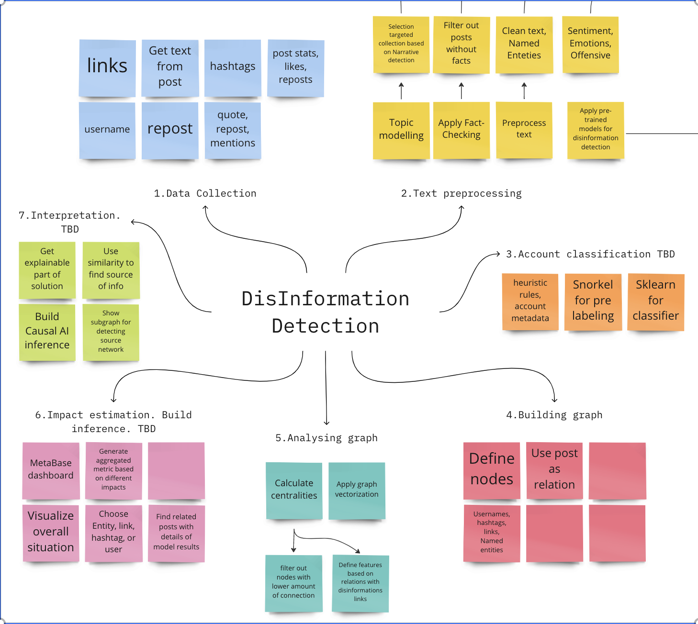

# DisInformation Detector by Valkyrie-2


# Description

The disinformation detector is a machine learning-based system that is designed to identify dis/misinformation in social media data. It is built using a combination of Transformer-based models from Hugging Face, and databases Neo4j, PostgreSQL for storing and analysing insights.

In addition the disinformation detector also includes feature generation techniques to obtain metadata about the social media data. For example, sentiment and emotional analysis, NER.

Centralities in the Neo4j graph can also be calculated to identify influential users and posts in the network, identify the most central users or posts in the network, bridges between different dis/mis/fake communities in the network.

By combining these feature generation techniques with machine learning algorithms and graph database technologies, the disinformation detector is able to detect patterns of disinformation in social media data and generate alerts and reports for further investigation. The system is designed to be highly scalable, flexible, and interoperable, making it suitable for use in a wide range of applications and settings.

## Branch structure
1. origin/main - description with all details and presentations
2. origin/data_preparation - data QC, selection subset for analysis and topic modelling
3. origin/feature/data_ingestion_functions - API for load and read data from PostgreSQL
4. origin/feature/linguistic_feature - apply Spacy for getting linguistic features
5. origin/feature/neo4j - build and analyse graph in Neo4j
6. origin/feature_generator - apply pre-trained models from Hugging Face, call API for fact-checking 

## High-level architecture steps

- Data Collection: The first step is to collect data from social media platforms such as Twitter. This can be done using APIs provided by the platforms themselves, or third-party tools that specialize in social media data collection.

- Preprocessing: The collected data may contain noise or irrelevant information that needs to be removed. The data must be cleaned and filtered to obtain only the necessary text, images, and video content that is relevant to the analysis.

- Natural Language Processing (NLP): NLP is a crucial step in the disinformation detection process. The text content must be processed using NLP techniques such as tokenization, part-of-speech tagging, sentiment analysis, and topic modeling. NLP can help identify the key topics being discussed, the sentiment and tone of the posts, and the language used.

- Image and Video Analysis (**only idea**): Images and videos shared on social media can also contain disinformation, so it's important to analyze them as well. This can be done using computer vision techniques such as object detection, face recognition, and image classification.

- Feature Extraction: Once the data has been preprocessed, NLP and image analysis techniques can be used to extract features that can be used for disinformation detection. For example, features such as the sentiment of a post, the use of emotional language, or the presence of specific objects in an image can all be used as indicators of disinformation.

- Machine Learning Models: Machine learning models can be trained on the extracted features to classify posts as either disinformation or not. These models can be trained using supervised learning techniques, where labeled data is used to train the model, or unsupervised learning techniques, where the model learns to identify patterns in the data without being explicitly trained on labeled data.

- Post-processing: After the model has classified the posts, post-processing techniques can be applied to further refine the results. For example, posts that are classified as disinformation can be cross-checked with other sources to verify their accuracy.

- Visualization and Reporting: The final step is to visualize and report the results. This can be done using dashboards or reports that show the number of disinformation posts identified, the most common types of disinformation, and other relevant metrics.



## Used technologies

- Python: Python is a high-level programming language that can be used to develop custom scripts and applications for various disinformation detection tasks. For example, Python can be used to automate data processing tasks, build machine learning models, and develop custom data visualization tools.
- Spacy (Python NLP Library): Spacy can be used for NLP tasks such as named entity recognition, dependency parsing, and text classification, which are all useful in identifying disinformation in text. For example, Spacy's named entity recognition can be used to detect and categorize entities such as people, organizations, and locations, while its dependency parsing can be used to analyze the relationships between words in a sentence or document.
- Hugging Face (NLP Library): Hugging Face provides pre-trained models and tools for natural language processing, including sentiment analysis, text classification. These tools can be used to identify the emotional tone, intention, and veracity of text, making them useful in detecting disinformation.
- ClaimBuster (Free API) is the umbrella under which all fact-checking related projects for the IDIR Lab fall under. It started as an effort to create an AI model that could automatically detect claims worth checking. Since then it has steadily made progress towards the holy grail of automated fact-checking.
- Gensim (Topic Modeling Library): Gensim is a library for topic modeling and document similarity analysis, which can be used to identify similarities and patterns in large volumes of text. By analyzing the similarities between documents and topics, Gensim can help to identify potential cases of disinformation and trace their sources.
- PostgreSQL (Database Management System): PostgreSQL is a database management system that can be used to store and query large volumes of text and metadata, such as information about the sources and authors of documents. By using PostgreSQL to store and manage data, analysts and researchers can more efficiently identify and analyze potential cases of disinformation.
- Neo4j (Graph Database): Neo4j is a graph database that can be used to model and analyze complex networks, such as those involved in the spread of disinformation. By using Neo4j to visualize and analyze the relationships between different entities, such as people, organizations, and topics, analysts and researchers can gain valuable insights into the sources and spread of disinformation.
- Metabase (Business Intelligence and Data Visualization Tool): Metabase is a business intelligence and data visualization tool that can be used to create custom dashboards and reports for analyzing data related to disinformation. By using Metabase, analysts and researchers can more easily visualize and share data insights, making it easier to detect and analyze potential cases of disinformation.

## General details
1. We use only the data provided
   1. News data for defining examples of non dis/missinformation
   2. twitter data for select dataset for train/test model
   3. we skip russian_invasion_of_ukraine.csv data, becouse for comments we have very short texts and issue with score's distribution
2. We use ONLY an open source / non-propriety – application / code / tools.
3. Our microservice architecture define real-time, and secure usage.
4. We include SoTA Transformer based models and API for train/tune from Hugging Face, different data representations (metadata in PostgreSQL, relations in Neo4j)
5. Our solution can be improved with adding new API for recognize features, or interpreter results with BI reports or applying Causal AI inference

6. Each component we defile as microservice, which give ability to add new functionality.
7. We create a PoC solution from scratch
8. We need to add deployment for move to Minimum Viable Product (MVP), also we add ability to include information exchange with other systems

# Day 1

## Data collection
1. Read files and parse jsons in columns, check types
```
data_real = pd.concat([data['nyt_russia_ukraine'],
                      data['guardians_russia_ukraine']],
                     axis=0, sort=False)
data_real['published'] = pd.to_datetime(data_real['published'])
data_real.shape

data_tweet = pd.concat([data['ukraine_troops'],
                      data['ukraine_war'],
                      data['russia_invade'],
                      data['ukraine_nato'],
                      data['russian_troops'],
                      data['standwithukraine'],
                      data['ukraine_border'],
                      data['russian_border_ukraine']],
                     axis=0, sort=False).drop(['_type', 'source', 'sourceUrl',
                                              'cashtags'], axis=1)
# parce dates and jsons in columns
data_tweet['date'] = pd.to_datetime(data_tweet['date'])
data_tweet['user'] = data_tweet['user'].progress_apply(load_json)
data_tweet['username'] = data_tweet['user'].apply(lambda x: x['username'])

data_tweet['inReplyToUser'] = data_tweet['inReplyToUser'].fillna('{}').progress_apply(load_json)
data_tweet['mentionedUsers'] = data_tweet['mentionedUsers'].fillna('{}').progress_apply(load_json)
data_tweet['quotedTweet'] = data_tweet['quotedTweet'].fillna('{}').progress_apply(load_json)

data_score = data['russian_invasion_of_ukraine'].copy()
data_score['timestamp'] = pd.to_datetime(data_score['timestamp'])
data_score.shape
```
2. Filter only EN lang, drop constant columns
```
<class 'pandas.core.frame.DataFrame'>
Int64Index: 787029 entries, 0 to 53039
Data columns (total 30 columns):
 #   Column            Non-Null Count   Dtype              
---  ------            --------------   -----              
 0   url               787029 non-null  object             
 1   date              787029 non-null  datetime64[ns, UTC]
 2   content           787029 non-null  object             
 3   renderedContent   787029 non-null  object             
 4   id                787029 non-null  int64              
 5   user              787029 non-null  object             
 6   replyCount        787029 non-null  int64              
 7   retweetCount      787029 non-null  int64              
 8   likeCount         787029 non-null  int64              
 9   quoteCount        787029 non-null  int64              
 10  conversationId    787029 non-null  int64              
 11  lang              787029 non-null  object             
 12  sourceLabel       787029 non-null  object             
 13  outlinks          787029 non-null  object             
 14  tcooutlinks       787029 non-null  object             
 15  media             87646 non-null   object             
 16  retweetedTweet    0 non-null       float64            
 17  quotedTweet       787029 non-null  object             
 18  inReplyToTweetId  372343 non-null  float64            
 19  inReplyToUser     787029 non-null  object             
 20  mentionedUsers    787029 non-null  object             
 21  coordinates       10281 non-null   object             
 22  place             10281 non-null   object             
 23  hashtags          787029 non-null  object             
 24  Searh             787029 non-null  object             
 25  username          787029 non-null  object             
 26  replied_user      372343 non-null  object             
 27  quoted_user       75799 non-null   object             
 28  quoted_id         75799 non-null   float64            
 29  mentioned_users   787029 non-null  object             
dtypes: datetime64[ns, UTC](1), float64(3), int64(6), object(20)
memory usage: 186.1+ MB
```
3. Load data in PostgreSQL


## Data Processing
1. Text Cleaning: Remove any irrelevant information such as URLs, usernames, hashtags, and special characters using regular expressions.
2. Tokenization: Split the text data into individual words or subwords using a tokenizer such as NLTK or SpaCy.
3. Stop Word Removal: Remove stop words such as "the," "a," and "an" that are common in the English language and do not contribute much to the meaning of the text.
4. Stemming or Lemmatization: Reduce the words to their base form using stemming or lemmatization techniques. For example, "running," "ran," and "runs" can all be reduced to "run."
5. Named Entity Recognition: Identify named entities such as people, organizations, and locations using a named entity recognizer such as the one provided by SpaCy.
```bash
HTTP 200 OK
{
  "input": "WH fabricates allegations to serve as proof that Russians fabricated allegations to serve as proof of pretext to invade Ukraine. Russia denies allegation. US denies fabricating allegation but provides no evidence beyond alleging that it is so\nhttps://t.co/QG8ElqIMdF\nWhat a \ud83c\udfaa\ud83e\udd21\ud83e\udd2a",
  "lemmatized": [
    "WH",
    "fabricate",
    "allegation",
    ...
    "what",
  ],
  "entities": [
    {
      "text": "WH",
      "start_char": 0,
      "end_char": 2,
      "label": "ORG"
    },
    {
      "text": "Russians",
      "start_char": 49,
      "end_char": 57,
      "label": "NORP"
    },
    {
      "text": "Ukraine",
      "start_char": 120,
      "end_char": 127,
      "label": "GPE"
    },
    {
      "text": "Russia",
      "start_char": 129,
      "end_char": 135,
      "label": "GPE"
    },
    {
      "text": "US",
      "start_char": 155,
      "end_char": 157,
      "label": "GPE"
    },
    {
      "text": "\ud83c\udfaa\ud83e\udd21",
      "start_char": 274,
      "end_char": 276,
      "label": "DATE"
    }
  ],
  "words": {
    "WH": {
      "count": 1,
      "pos": "PROPN",
      "is_stop": false
    },
    "fabricate": {
      "count": 2,
      "pos": "VERB",
      "is_stop": false
    },
    "allegation": {
      "count": 4,
      "pos": "NOUN",
      "is_stop": false
    },
    ...
  }
}
```
More details in [feature/linguistic_feature](https://github.com/tidehackathon/team-valkyrie-2/tree/feature/linguistic_feature).

# Day 2

## Feature generation
1. Apply pretrained models from Hugging Face for
   1. prelabed disinformation
   2. get sentiment, and emotions
```
source_data_file: ../Data/data_clean.pkl
dest_file: analysis_final.jsonl
batch_size: 20
start_from: null
end_at: null
features:
  twitter-roberta-base-sentiment-latest:
    model_path: "cardiffnlp/twitter-roberta-base-sentiment-latest"
    supports_cuda: True
  twitter-roberta-base-emotion:
    model_path: "cardiffnlp/twitter-roberta-base-emotion"
    supports_cuda: True
  distilroberta-propaganda-2class:
    model_path: "valurank/distilroberta-propaganda-2class"
    supports_cuda: True
  bert-finetuned-propaganda-18:
    model_path: "MM2157/bert-finetuned-propaganda-18"
    supports_cuda: False
  Fake-News-Bert-Detect:
    model_path: "jy46604790/Fake-News-Bert-Detect"
    supports_cuda: True
```
More details in [feature_generator/main.py](https://github.com/tidehackathon/team-valkyrie-2/blob/feature_generator/feature_generator/main.py).

## Topic modelling
First, accounts whose tweets contain keywords relevant to the subject or exhibit predefined, heuristic behavioral patterns within a relevant time period are identified. Second, content from these accounts is passed to a topic modeling algorithm, and all topics are represented by a collection or bag of words. Third, interesting topics are identified manually. Fourth, tweets that match these topics above a predefined threshold are selected. Fifth, a narrative network is constructed with vertices defined by accounts whose content matches the selected narrative and edges defined by retweets between these accounts.
```
# Build LDA model
lda_model = gensim.models.ldamodel.LdaModel(corpus=corpus,
                                           id2word=id2word,
                                           num_topics=10, 
                                           random_state=100,
                                           update_every=1,
                                           chunksize=100,
                                           passes=10,
                                           alpha='auto',
                                           per_word_topics=True)

[(0,
  '0.433*"border" + 0.032*"tension" + 0.024*"cross" + 0.022*"war" + '
  '0.018*"video" + 0.014*"people" + 0.014*"buildup" + 0.013*"make" + '
  '0.011*"urge" + 0.009*"weapon"'),
 (1,
  '0.108*"show" + 0.103*"crisis" + 0.083*"unit" + 0.061*"guard" + '
  '0.045*"equipment" + 0.028*"large" + 0.028*"watch" + 0.027*"look" + '
  '0.026*"missiles_advance" + 0.026*"happen"'),
 (2,
  '0.094*"build" + 0.070*"state" + 0.058*"come" + 0.053*"belarusian" + '
  '0.046*"also" + 0.046*"time" + 0.034*"defend" + 0.030*"way" + 0.029*"big" + '
  '0.028*"aggression"'),
 (3,
  '0.184*"russian" + 0.066*"ukraine" + 0.051*"military" + 0.044*"force" + '
  '0.041*"say" + 0.033*"ukrainian" + 0.029*"troop" + 0.026*"invasion" + '
  '0.019*"move" + 0.017*"attack"'),
  ...
```

More details in [data_subset_topic_modelling.ipynb](https://github.com/tidehackathon/team-valkyrie-2/blob/data_preparation/data_subset_topic_modelling.ipynb).

## Apply ClaimBuster (Free API) for fact-checking 
```
INPUT_PATH = 'posts_info.jsonl'
OUTPUT_PATH = 'claimbuster.json'

BATCH_SIZE = 1000
MAX_SIZE = 1000000
THREADS = 10
URL_RETRIES = 10
URL_SLEEP = 5


CLAIMBUSTER_API_KEY = os.environ['CLAIMBUSTER_API_KEY']
HEADERS = {'x-api-key': CLAIMBUSTER_API_KEY}
URL = 'https://idir.uta.edu/claimbuster/api/v2/score/text/'
LOG_PATH = 'claimbuster.log'
```
```
INSERT_QUERY = """
insert into metabase.claimbuster (
    post_id, 
    score
) 
values %s
"""
SELECT_QUERY = """
SELECT 
    id as post_id, 
    content_rendered 
FROM 
    metabase.posts
"""
STAGE_FILE = 'data_stage.jsonl'
```
More details in [claimbuster.py](https://github.com/tidehackathon/team-valkyrie-2/blob/feature_generator/feature_generator/claimbuster.py).
# Day 3

## Building Neo4J graph
1. Define nodes
   1. Domains from links
   2. usernames
   3. hashtags
   4. Named Enteties
2. Define relations
   1. post as relation between any node from metadata for the post
```
def insert_data(obj, data):
    obj.run("""
WITH $data AS data
UNWIND data AS tweet
MERGE (s:Source {id: tweet.source_id})
ON CREATE SET s.name = tweet.source_name
FOREACH (domain IN tweet.domains |
  MERGE (d:Domain {domain: domain.domain})
  ON CREATE SET d.score = domain.score
  MERGE (s)-[:POSTED_DOMAIN {id: tweet.original_id}]->(d)
  MERGE (d)-[:DOMAIN_POSTED_BY {id: tweet.original_id}]->(s)
)
FOREACH (tag IN tweet.hashtags |
  MERGE (h:Hashtag {tag: tag})
  MERGE (s)-[:POSTED_TAG {id: tweet.original_id}]->(h)
  MERGE (h)-[:TAG_POSTED_BY {id: tweet.original_id}]->(s)
)
FOREACH (reference IN tweet.references |
  MERGE (s2:Source {id: reference})
  MERGE (s)-[:REFERRED {id: tweet.original_id}]->(s2)
  MERGE (s2)-[:REFERRED_BY {id: tweet.original_id}]->(s)
)
""", data=data)
```

## Analyse centralities
1. For each type of nodes we calculate eigenvector centrality
```
def analyze_hashtag_data(obj):
    timestamp = time.time()
    query = """
    CALL gds.graph.project('Hashtags', ['Source', 'Hashtag'],
        ['POSTED_TAG', 'TAG_POSTED_BY'])
    """
    obj.run(query)

    query = """
    CALL gds.eigenvector.write(
        'Hashtags',
        {maxIterations: 20, scaler: 'MinMax', writeProperty: 'hashtagsCentrality'})
    """
    obj.run(query)
    print('Analyzed hashtag data in {} s'.format(time.time() - timestamp))

def analyze_referred_data(obj):
    timestamp = time.time()
    query = """
    CALL gds.graph.project('References', 'Source',
        ['REFERRED', 'REFERRED_BY'])
    """
    obj.run(query)

    query = """
    CALL gds.eigenvector.write(
        'References',
        {maxIterations: 20, writeProperty: 'referencesCentrality'})
    """
    obj.run(query)
    print('Analyzed referred data in {} s'.format(time.time() - timestamp))
```

2. Also we mark some domains as DO (disinformation operations, target=1) or news providers (NYT, target=0), and calculate posDomainsCentrality and negDomainsCentrality.
```
def analyze_domain_data(obj):
    timestamp = time.time()
    query = """
    CALL gds.graph.project('Domains', ['Source', 'Domain'],
        ['POSTED_DOMAIN', 'DOMAIN_POSTED_BY'])
    """
    obj.run(query)

    query = """
    MATCH (PosDomain:Domain {score: 1})
    CALL gds.eigenvector.write(
        'Domains',
        {maxIterations: 20, writeProperty: 'posDomainsCentrality', sourceNodes: [PosDomain]})
    YIELD nodePropertiesWritten, ranIterations
    RETURN distinct 'done'
    """
    obj.run(query)

    query = """
    MATCH (NegDomain:Domain {score: -1})
    CALL gds.eigenvector.write(
        'Domains',
        {maxIterations: 20, writeProperty: 'negDomainsCentrality', sourceNodes: [NegDomain]})
    YIELD nodePropertiesWritten, ranIterations
    RETURN distinct 'done'
    """
    obj.run(query)
    print('Analyzed domain data in {} s'.format(time.time() - timestamp))
```

More details in [graph.py](https://github.com/tidehackathon/team-valkyrie-2/blob/feature/neo4j/graph.py).

## Prepare dataset for model development


# Day 4

## Finalize microservice Architecture

## Visualization in Metabase


# Next steps
1. Add dockerfiles for each component
2. Add dockercompose to up 